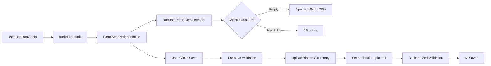

# Fix Profile Validation & Completeness Calculation

## Problem Analysis

### Issue 1: Completeness Score Stuck at 70%

**Location**: [`calculator.ts`](shared/lib/profile/calculator.ts) line 76The calculator only checks `q.audioUrl`:

```typescript
const answeredCount = profile.questions?.filter(q => q.questionId && q.audioUrl).length || 0
```

**Problem**: When users record audio locally (stored as `audioFile` Blob), `audioUrl` is empty until upload. The calculator gives 0 points for questions section (15%), capping the score at 85% max (or lower if other fields are incomplete).**Real-world scenario**: User fills everything, records 3 audio answers locally, but sees 70% instead of 100% because the calculator doesn't recognize local recordings.

### Issue 2: Type System Inconsistency

**Locations**:

- [`user.ts`](shared/types/user.ts) - `QuestionAnswer` interface (lines 31-35)
- Frontend form state - `QuestionAnswerFormState` with `audioFile?: Blob | string`

**Problem**: The shared `QuestionAnswer` type doesn't include `audioFile`, but frontend needs it for local recording state. The calculator receives form data with `audioFile` but the TypeScript type doesn't allow it.

### Issue 3: Zod Schema Too Strict for Form State

**Location**: [`profile.validation.ts`](shared/validations/profile.validation.ts) lines 16-23

```typescript
export const questionAnswerSchema = z.object({
  questionId: z.string().min(1, "Question ID is required").refine(...),
  audioUrl: z.string().url("Invalid audio URL"),  // ❌ Fails for empty string
  uploadId: z.string().min(1, "Upload ID is required"),  // ❌ Fails for empty string
});
```

**Issue**: This schema is used for BOTH:

1. Frontend form validation (where local recordings exist)
2. Backend API validation (where uploads must be complete)

The previous fix added pre-save validation to prevent submission, but the schema itself still causes form validation errors during the recording phase.

## Data Flow Diagram



## Solution Architecture

### 1. Extend Shared Types for Form State

**File**: [`user.ts`](shared/types/user.ts)Add a new type for form state that includes the optional `audioFile`:

```typescript
export interface QuestionAnswerWithFile extends QuestionAnswer {
  audioFile?: Blob | string
}
```

This allows the calculator to accept form state without breaking backend types.

### 2. Update Calculator Logic

**File**: [`calculator.ts`](shared/lib/profile/calculator.ts)Modify line 76 to check for EITHER `audioUrl` OR `audioFile`:

```typescript
const answeredCount = profile.questions?.filter(q => {
  const hasQuestionId = !!q.questionId
  const hasAudioUrl = !!q.audioUrl
  const hasAudioFile = !!(q as any).audioFile // Check for local recording
  return hasQuestionId && (hasAudioUrl || hasAudioFile)
}).length || 0
```

Allow the calculator to accept the extended type:

```typescript
export const calculateProfileCompleteness = (
  profile: Partial<ProfileUpdateRequest & { questions?: QuestionAnswerWithFile[] }> = {},
  contactInfo: Partial<UserContactInfo> = {}
): ProfileCompletenessResult => {
  // ... implementation
}
```

### 3. Relax Frontend Form Schema

**File**: [`useProfileForm.ts`](frontend/src/features/profile/hooks/useProfileForm.ts)The frontend already extends the schema (lines 18-27). Enhance it to make `audioUrl` and `uploadId` optional during form state:

```typescript
const questionAnswerFormSchema = z.object({
  questionId: z.string().min(1, "Question ID is required").refine(
    (id) => QUESTION_POOL.some(q => q.id === id),
    { message: "Question ID not found in the QUESTION_POOL" }
  ),
  audioUrl: z.string().optional(),
  uploadId: z.string().optional(),
  audioFile: z.union([z.instanceof(Blob), z.string()]).optional()
})

const formSchema = profileUpdateSchema
  .omit({ questions: true })
  .extend({
    voiceIntro: z.string().optional(),
    instagram: contactInfoSchema.shape.instagram,
    voiceIntroFile: z.union([z.instanceof(Blob), z.string()]).optional(),
    questions: z.array(questionAnswerFormSchema).length(3, "Please record 3 questions")
  })
  .refine(data => data.voiceIntro || data.voiceIntroFile, {
    message: 'Please record a voice introduction',
    path: ['voiceIntro']
  })
```

This allows form validation to pass during recording phase, while the pre-save validation (already implemented) ensures uploads are complete before submission.

### 4. Keep Backend Schema Strict

**File**: [`profile.validation.ts`](shared/validations/profile.validation.ts)**No changes needed** - the backend schema should remain strict. The pre-save validation in the previous fix already ensures only valid data reaches the backend.

## Implementation Steps

### Step 1: Update Shared Types

- Add `QuestionAnswerWithFile` interface to [`user.ts`](shared/types/user.ts)
- Export it for use in calculator and frontend

### Step 2: Fix Calculator Logic

- Update [`calculator.ts`](shared/lib/profile/calculator.ts) line 76 to check for `audioFile` OR `audioUrl`
- Update type signature to accept extended question type
- Add comment explaining the dual-state handling

### Step 3: Relax Frontend Form Schema

- Update [`useProfileForm.ts`](frontend/src/features/profile/hooks/useProfileForm.ts) to use relaxed question schema for form validation
- Keep pre-save validation strict (already implemented)

### Step 4: Verify Score Calculation

- Test that all 7 categories sum to 100%:
- Basic Info (Age + Gender): 20%
- Photo: 10%
- Bio: 10%
- Interests: 10%
- Questions (3 × 5%): 15%
- Voice Intro: 15%
- Instagram: 20%
- **Total: 100%** ✅

## Expected Outcomes

After implementation:

1. ✅ **Completeness reaches 100%** when all fields are filled, even with local recordings
2. ✅ **No form validation errors** during the recording phase
3. ✅ **Pre-save validation prevents submission** of incomplete questions (already implemented)
4. ✅ **Backend validation remains strict** - only accepts uploaded audio with valid URLs
5. ✅ **Type consistency** across shared types and frontend extensions
6. ✅ **Clear UX** - users see progress immediately when recording locally

## Technical Notes

- The calculator is shared between frontend and backend
- Frontend passes form state with `audioFile` for real-time progress
- Backend only stores `audioUrl` + `uploadId` after upload