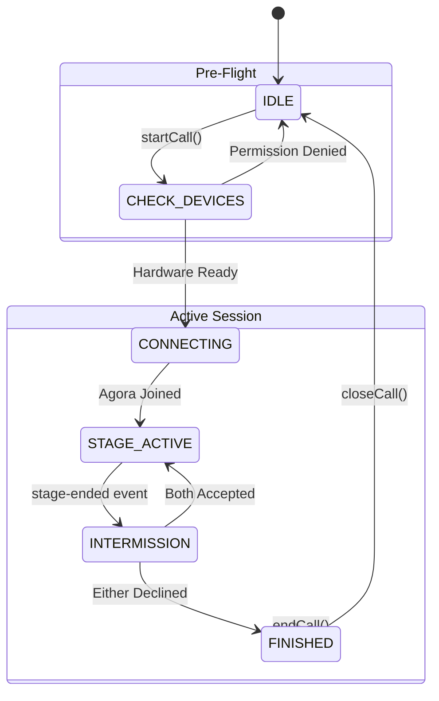
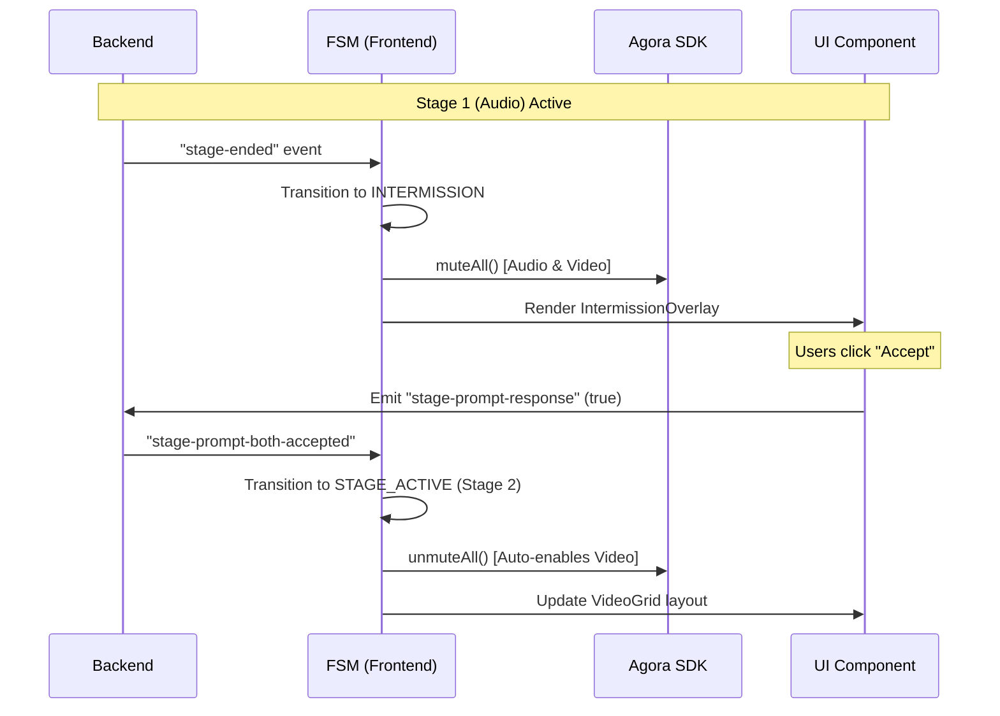

# Flint System Design - Refactored Real-time Architecture

## 1. Overview
This document details the refactored real-time communication and call orchestration system in Flint. The architecture has evolved from a modal-driven, fragmented approach to a centralized, Finite State Machine (FSM) driven system that ensures predictability, performance, and a "navigation-less" user experience.

---

## 2. Global Socket Foundation
The foundation of the system is the `GlobalSocketProvider`, which establishes a persistent, authenticated WebSocket connection at the root of the application.

### Key Characteristics:
- **Singleton Pattern:** Only one Socket.io client exists per session.
- **Auto-Reconnection:** Handles JWT-based authentication on reconnect.
- **Global Event Bus:** Serves as a centralized listener for non-interactive events (e.g., global notifications, system alerts).
- **Match Interactivity:** Exposes standard methods for joining (`joinMatch`) and leaving (`leaveMatch`) active conversation rooms.

---

## 3. Unified Call Engine (FSM)
The core of the call system is the `UnifiedCallInterface`, controlled by a Finite State Machine. This engine abstracts the complexity of Agora RTC and Socket.io behind a predictable state-driven UI.

### State Transition Diagram

### State Definitions
| State | Component | Responsibility |
| :--- | :--- | :--- |
| **IDLE** | *None* | System waiting for trigger. |
| **CHECK_DEVICES** | `DeviceCheckScreen` | Hardware permission verification and retry logic. |
| **CONNECTING** | `ConnectingScreen` | Showing partner preview while establishing Agora connection. |
| **STAGE_ACTIVE** | `ActiveCallContainer` | The main Agora UI (Video/Audio) and session timer. |
| **INTERMISSION** | `IntermissionOverlay` | In-place decision UI between stages. Streams are muted but active. |
| **FINISHED** | `CallEndedScreen` | Post-call summary and navigation return. |

---

## 4. Staged Call Logic (Phase 3 Evolution)
One of the most significant refactors was the transition from "Navigation-Based Stages" to "In-Place Orchestration."

### The "In-Place" Flow
Unlike the legacy system which forced a redirect back to the chat thread between stages, the new system maintains the Agora connection and DOM structure throughout the entire multi-stage session.

#### Sequence Diagram: Stage Transition

---

## 5. Live Call Integration
The Live Call (matchmaking) feature now delegates all media and orchestration logic to the Unified Call Engine.

- **Trigger:** When `useLiveCall` receives the `MATCH_FOUND` socket event, it invokes `startCall()` with `callType: 'live'`.
- **Logic Shifting:** Agora initialization, client joining, and device checking are removed from the Live Call feature and handled by the unified `ActiveCallContainer`.
- **UI Consistency:** Users experience the same "Pre-flight" and "Active" UI regardless of whether they are in a Live or Staged call.

---

## 6. Directory Structure (Refactored)

### `src/features/call-system/`
- **`context/`**: `CallSystemContext` - The global orchestrator state.
- **`hooks/`**:
  - `useCallFSM`: The state machine reducer and transition logic.
  - `useHardwareGate`: Individual logic for camera/mic permissions.
- **`components/`**:
  - `UnifiedCallInterface`: The top-level root component.
  - `ActiveCallContainer`: Standardized Agora UI.
  - `IntermissionOverlay`: In-place stage decision UI.

### `src/features/realtime/`
- **`context/`**: `GlobalSocketContext` - Persistent signalling connection.
- **`hooks/`**:
  - `useChat`: Refactored to use the global socket.
  - `useStagedCall`: Backend synchronization for call states.

---

## 7. Persistence & Lifecycle
Calls are managed at the **app root level** (`providers.tsx`). This ensures that:
1.  Calls do not drop during navigation.
2.  Incoming calls can be detected and displayed from any screen in the application.
3.  The `UnifiedCallInterface` acts as a global singleton overlay.
